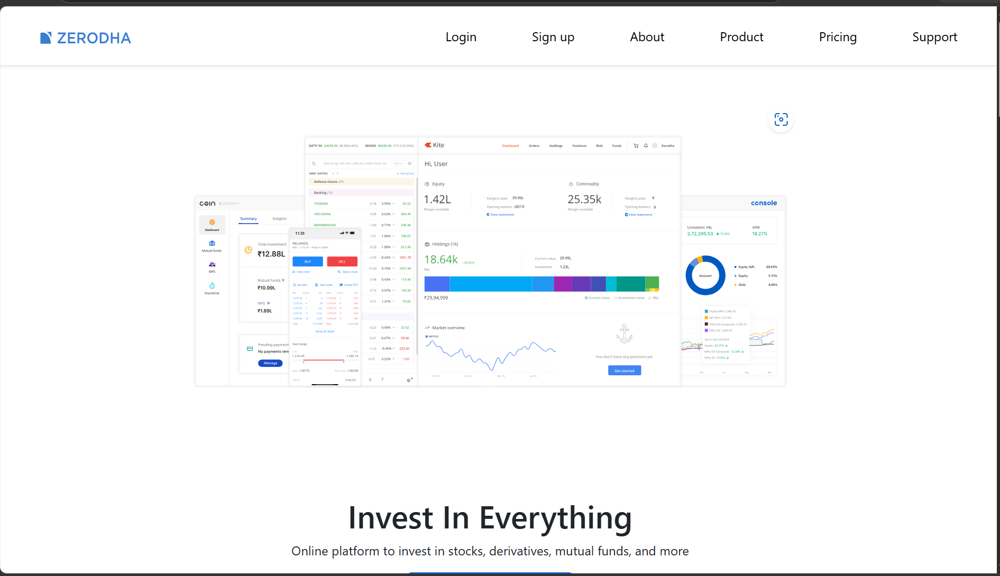
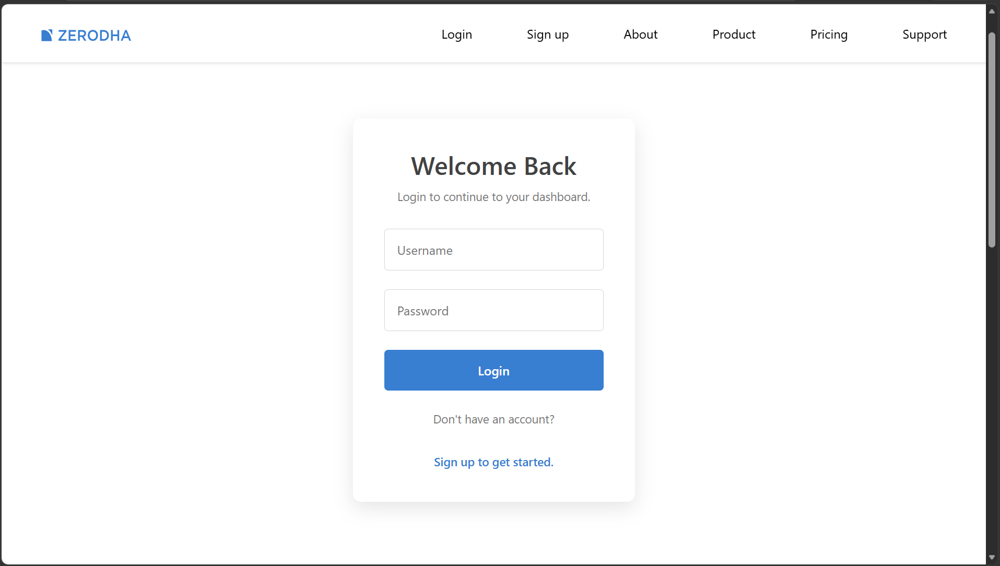
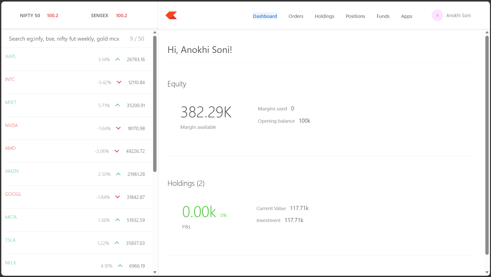
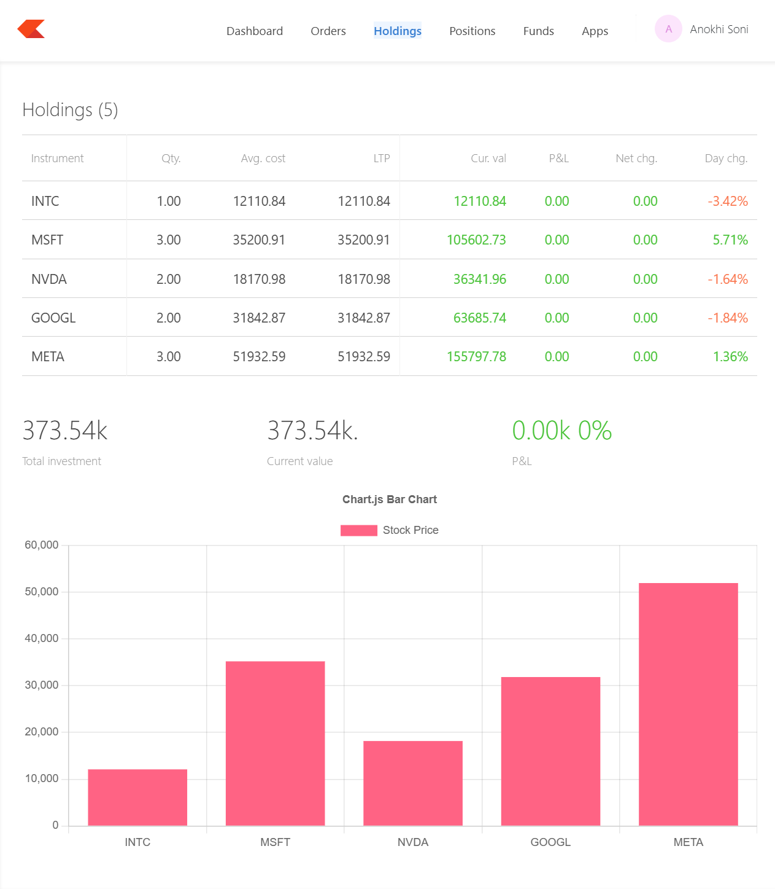
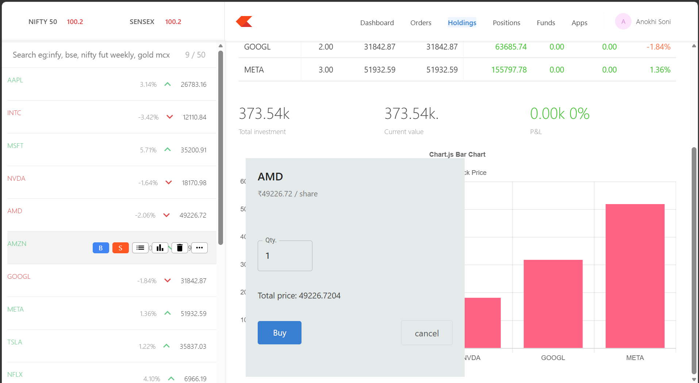
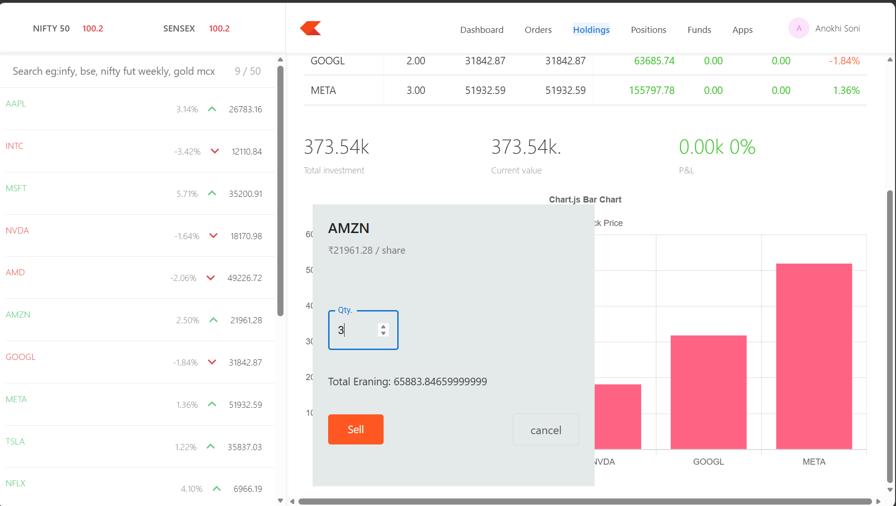

<div align="center">

# 📈 Zerodha Clone

### A Full-Stack MERN Stock Trading Platform Inspired by Zerodha

A feature-rich stock trading platform where users can securely manage their portfolio, buy & sell stocks, monitor holdings, and analyze investments through an interactive dashboard.


⭐ If you found this project interesting, consider giving it a star!

</div>

---

# 🌐 Live Demo

| Application | Link |
|------------|------|
| 🏠 Frontend | **https://stock-trading-frontend-0nq6.onrender.com** |
| 📊 Dashboard | **https://stock-trading-frontend-0nq6.onrender.com** |
| ⚙️ Backend API | **https://stock-trading-frontend-0nq6.onrender.com** |

---

# 🎥 Project Demo

> 📹 **Add a GIF or short video demonstrating the project here.**


# 📸 Screenshots

## 🏠 Home Page

> 

---

## 🔐 Login Page

> 

---

## 📊 Dashboard

> 

---

## 💼 Holdings

> 

---

## 💹 Buy Stock

> 

---

## 💰 Sell Stock

> 

---

# 📖 About the Project

This project is a full-stack clone of the **Zerodha trading platform**, built using the **MERN Stack**.

The goal of this project was to understand how modern stock trading platforms work by implementing real-world functionalities such as authentication, portfolio management, buying and selling stocks, holdings management, profit & loss calculations, and interactive dashboards.

The application provides users with a seamless experience for managing their virtual investments while maintaining a clean and responsive interface.

---

# ✨ Features

## 🔐 Authentication

- User Registration
- Secure Login
- JWT Authentication
- Protected Routes
- Password Encryption

---

## 💹 Trading

- Buy Stocks
- Sell Stocks
- Automatic Holdings Update
- Wallet Balance Management
- Average Buying Price Calculation

---

## 📊 Portfolio Management

- Holdings
- Positions
- Portfolio Summary
- Investment Value
- Current Value
- Profit & Loss Calculation

---

## 📈 Dashboard

- Interactive Portfolio Charts
- Holdings Overview
- Portfolio Analytics
- Responsive Data Tables

---

## 🎨 User Interface

- Responsive Design
- Clean & Modern Layout
- Smooth Navigation
- Material UI Icons

---

# 🏗 Project Architecture

```text
                 React Frontend
                        │
                  Axios API Calls
                        │
                        ▼
               Express REST APIs
                        │
               JWT Authentication
                        │
                        ▼
                 MongoDB Database
```

---

# 🛠 Tech Stack

### Frontend

- React.js
- React Router DOM
- Axios
- Material UI
- CSS

### Backend

- Node.js
- Express.js
- JWT Authentication
- REST APIs

### Database

- MongoDB
- Mongoose

### Deployment

- Render

---

# 📂 Project Structure

```text
Zerodha-Clone
│
├── frontend
│
├── dashboard
│
├── backend
│
└── README.md
```

---

# 🚀 Installation

Clone the repository

```bash
git clone https://github.com/anokhi-soni/Stock-trading-platform.git
```

Move into the project directory

```bash
cd Zerodha
```

Install frontend dependencies

```bash
cd frontend
npm install
```

Install dashboard dependencies

```bash
cd dashboard
npm install
```

Install backend dependencies

```bash
cd backend
npm install
```

---

# ▶️ Running the Project

Start Backend

```bash
nodemon index.js
```

Start Frontend

```bash
npm start
```

Start Dashboard

```bash
npm start
```

---

# 🔑 Environment Variables

### Backend

```env
PORT=5000

MONGO_URL=YOUR_MONGODB_CONNECTION_STRING

JWT_SECRET=YOUR_SECRET_KEY
```

---

### Frontend

```env
REACT_APP_BACKEND_URL=YOUR_BACKEND_URL

REACT_APP_DASHBOARD_URL=YOUR_DASHBOARD_URL
```

---

### Dashboard

```env
REACT_APP_BACKEND_URL=YOUR_BACKEND_URL
```

---

# 📚 What I Learned

Developing this project helped me strengthen my understanding of:

- MERN Stack Development
- REST API Design
- JWT Authentication
- MongoDB Data Modeling
- Live Stock Market API Integration
- Real-Time Stock Prices
- Portfolio & Profit/Loss Calculations
- React State Management
- Backend Architecture
- Deployment using Render
- Production Debugging
- Git & GitHub Workflow

---

# 🚀 Future Enhancements

- Search Stocks
- Watchlist Management
- Transaction History
- Portfolio Performance Graph
- Candlestick Charts
- Email Verification
- Password Reset
- Dark Mode

---

# 🤝 Contributing

Contributions are welcome!

If you have suggestions or improvements, feel free to fork the repository and submit a pull request.

---

# 👨‍💻 Developer

**Anokhi Soni**

Full Stack MERN Developer

---

<div align="center">

## ⭐ Thank you for visiting this repository!

If you enjoyed exploring this project, please consider leaving a ⭐.

Made with ❤️ using the MERN Stack.

</div>